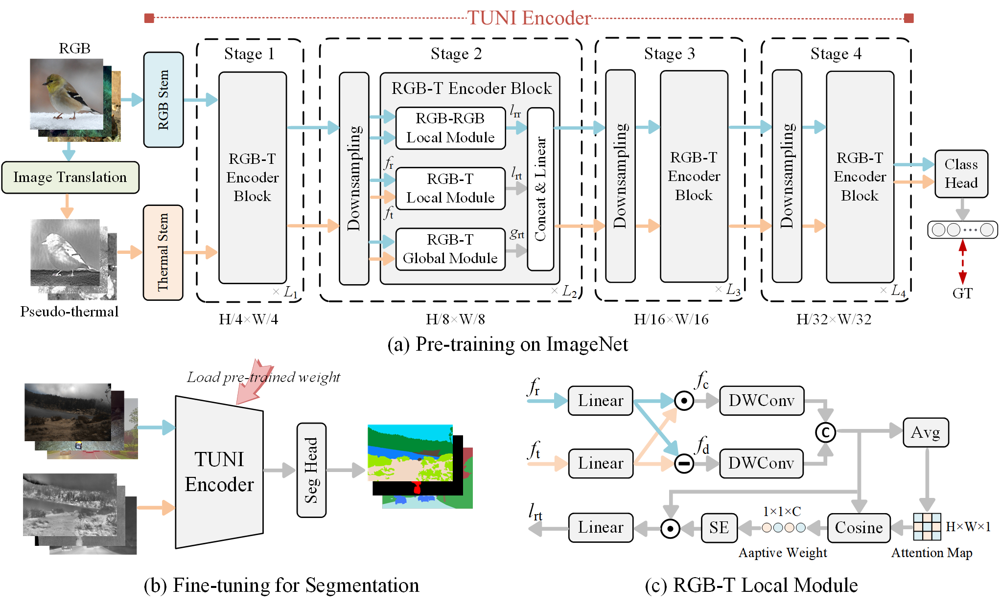

# TUNI: Real-time RGB-T Semantic Segmentation with Unified Multi-Modal Feature Extraction and Cross-Modal Feature Fusion
## Introduction
This repository contains the code for TUNI, which has been submitted to ICRA 2026. The current repository includes the model files, evaluation files, pre-trained weights, and prediction images to facilitate the review process.

✨**2025-9-5**✨ : Upload model files, evaluation files, pre-trained weights, prediction images. 

## Method 

Illustration of TUNI. The TUNI encoder consists of multiple stacked RGB-T encoder blocks, each of which includes an RGB-RGB local module,
an RGB-T local module, and an RGB-T global module. The encoder is first pre-trained on RGB and pseudo-thermal data, and then fine-tuned with a
lightweight segmentation head on downstream task datasets.

## Reqiurements
Python==3.9  
Pytorch==2.0.1  
Cuda==11.8  
mmcv==2.2.0  
## Experiment

# Acknowledgement
Our code is heavily based on [sRGB-TIR](https://github.com/RPM-Robotics-Lab/sRGB-TIR/tree/main) and [DFormer](https://github.com/VCIP-RGBD/DFormer/tree/main), thanks for their excellent work!
# Concat
If any questions, please contact 3120245534@bit.edu.cn.
