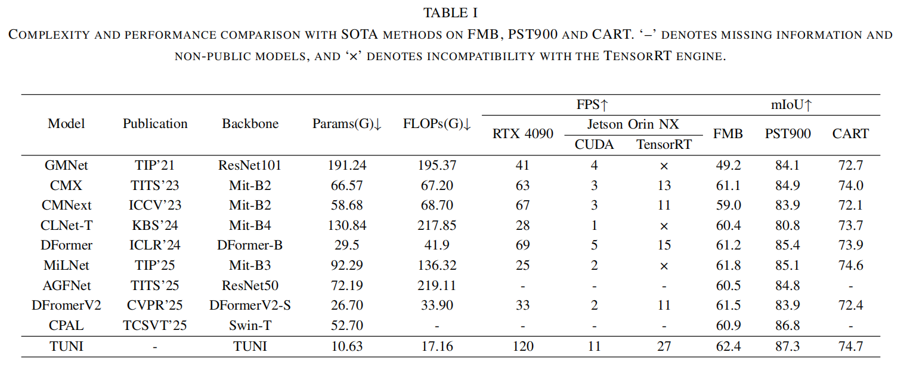

# TUNI: Real-time RGB-T Semantic Segmentation with Unified Multi-Modal Feature Extraction and Cross-Modal Feature Fusion
## Introduction
This repository contains the code for TUNI, which has been submitted to ICRA 2026. The current repository includes the model files, evaluation files, pre-trained weights, and prediction images to facilitate the review process.

## 🌟  NEWS
✨**2025-9-5**✨ : Submit an initial version of the repository, including the model files, evaluation scripts, pre-trained weights, and results images.

## Method

Illustration of TUNI. The TUNI encoder consists of multiple stacked RGB-T encoder blocks, each of which includes an RGB-RGB local module,
an RGB-T local module, and an RGB-T global module. The encoder is first pre-trained on RGB and pseudo-thermal data, and then fine-tuned with a
lightweight segmentation head on downstream task datasets.

## Reqiurements
Python==3.9  
Pytorch==2.0.1  
Cuda==11.8  
mmcv==2.2.0 
## Training Step 
Step1. Translating the RGB images of ImageNet to thermal ones by [sRGB-TIR](https://github.com/RPM-Robotics-Lab/sRGB-TIR/tree/main).  
Step2. Conducting [RGB-T pre-training](https://github.com/VCIP-RGBD/RGBD-Pretrain)  
Step3. Fine-tuning RGB-T semantic segmentation models on [FMB](https://github.com/JinyuanLiu-CV/SegMiF), [PST900](https://github.com/ShreyasSkandanS/pst900_thermal_rgb) and [CART](https://github.com/aerorobotics/caltech-aerial-rgbt-dataset).
## Experiment

## Weights and results
The model weights and prediction images can be found .

## Acknowledgement
Our code is heavily based on [sRGB-TIR](https://github.com/RPM-Robotics-Lab/sRGB-TIR/tree/main) and [DFormer](https://github.com/VCIP-RGBD/DFormer/tree/main), thanks for their excellent work!
## Concat
If any questions, please contact 3120245534@bit.edu.cn.
